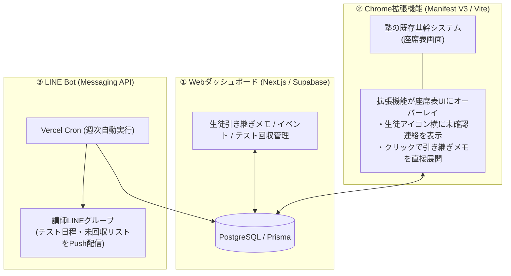

# 個別指導塾における主任講師マネジメントと教室業務DX
### (Classroom Operations Management & Systems DX: Juku-Sapo & SUTASAKU)

[-orange?style=flat-square)]()

---

## 📌 概要 (Overview)

個別指導塾の主任講師として、自校舎（講師30名・生徒80名）の教室運営・講師育成・業務標準化を統括。現場で発生していた情報共有の断絶や形骸化の課題に対し、**「既存業務への追加（+α）は形骸化し、置き換えのみが定着する」**という行動原則を確立しました。

この思想に基づき、改修不可能な既存基幹システムと現場動線をシームレスに統合する教室サポートシステム**「塾サポ」**を自らフルスクラッチで設計・開発。自校舎での運用実績をもとに複数校舎を統括するオーナーへ提案し、**計4校舎への実運用展開**を実現しました。

---

## 👤 組織規模と担当役割 (Role & Responsibilities)

- **期間**: 講師（2021年5月〜） / 主任講師（2025年4月〜現在）
- **管轄規模**: 講師30名 / 生徒80名（自校舎：板橋校）
- **主な役割**:
  - 新人講師の採用・研修・メンター業務（指導基準の標準化）
  - 生徒・保護者面談およびカリキュラム進捗管理
  - 教室オペレーション改革（連絡事項・引き継ぎ・テスト回収業務の効率化）
  - 教室業務支援システム「塾サポ」および学習支援アプリ「スタサク」の企画・開発・導入

---

## 💡 直面した失敗と確立した行動原則 (Failure Analysis & Key Principle)

### 初期の失敗：追加施策の形骸化（実施率約2割）
主任講師着任当初、指導品質向上と生徒フォロー強化を狙い、「今日の学びシート」「夏期目標シート」といった紙ベースの振り返り施策を導入しました。しかし、結果として**実施率は約2割**にとどまり、現場で形骸化しました。

### 根本原因の特定
講師への個別ヒアリングを通じて判明した最大のボトルネックは、講師個人の意識の低さではなく**「多忙さ（通常業務への追加負担）」**でした。授業前後の限られた時間の中で、通常業務の上に「これも書いてください」と追加する施策は、忙しい週ほど優先順位が落ち、声かけが途絶えた瞬間に形骸化するという構造的欠陥がありました。

### 確立した組織改革の行動原則
> 🚨 **「通常業務への+α（追加）は必ず形骸化する。現場のフリクションを減らし、『既存業務を置き換える導線』だけが現場に定着する。」**

---

## 🚀 実践事例 1：教室サポートシステム「塾サポ」の構築と4校舎展開

### 1. 現場の構造的ペイン
| 分類 | 現場で起きていた事象 | 根本的な構造課題 |
|:---|:---|:---|
| **フロー情報の埋没** | 重要な連絡事項やテスト日程がLINEグループで流れ、確認漏れ・引き継ぎミスが多発 | 一時的なチャットツールに永続情報が混入し、検索・参照コストが高い |
| **ストック情報の断絶** | 生徒の配慮事項や過去メモが紙バインダーに閉じられ、授業前に確認されない | 物理ファイルを取り出す手間があり、授業開始直前の動線から外れている |
| **システム改修の壁** | 既存の塾基幹システムは本部管理のため改修・機能追加が一切不可能 | 外部ツールを別画面で開かせる運用は講師の入力負担を増やすため定着しない |

### 2. 「追加せず置き換える」3層アーキテクチャ
講師に「新しいツールを開いて入力させる」ことを完全に廃止し、**普段の行動導線に情報を割り込ませる**設計を徹底しました。

- **座席表オーバーレイ Chrome拡張**: 講師が授業前に必ず開く基幹システムの座席表画面上に、生徒の引き継ぎメモや未確認連絡事項を直接オーバーレイ表示。**「いつもの画面を見るだけ」**で必要な情報が目に入る状態を構築。
- **LINE Bot自動配信**: 講師がシステムを見に行かなくても、週次でテスト日程や未回収テスト一覧が自動で手元に届くPush型通知を実装。
- **Webダッシュボード**: 紙バインダーを完全廃止し、テスト回収管理（学校別・学年別・未回収の自動判定）と生徒メモを一元管理。

### 3. 組織展開と定量的成果
1. **実績に基づく直談判**: 自校舎（板橋校）で安定稼働させ、確固たる実績と現場の支持を形成。
2. **オーナー提案と即決導入**: 複数校舎を統括するオーナーへ直接プレゼンを実施。情報伝達ミスの撲滅による退塾防止や業務削減効果を客観提示し、**計4校舎（板橋校・東十条校・練馬高野台校・千石駅前店）での追加導入を即決で獲得**。各校室長からも「こういう現場目線のシステムが欲しかった」と高評価を獲得。
3. **達成指標**:
   - **講師利用率**: 対象講師の**約80%**がChrome拡張を日常利用
   - **テスト回収工数**: 手作業Excel集計から自動リスト化により**作業時間約50%削減**
   - **伝達ミス撲滅**: 口頭・紙の引き継ぎ漏れによるトラブルが大幅に減少

---

## 📈 実践事例 2：学習習慣定着プラットフォーム「スタサク」の運用定着

生徒向けアプリ「スタサク」においても、同様に「置き換え」と「現場制約の徹底排除」を適用しました。

- **30秒打刻導線**: 教室ディスプレイのOTP認証と座席ブースのNFCタグにより、授業開始前のわずかな時間で打刻完了。
- **研修による指導の標準化**: 単なる操作マニュアルではなく、「なぜこのKPI（無遅刻率・宿題達成度）を追うのか」「生徒を客観ログでどう褒めるか」を講師研修で徹底共有。
- **成果（5ヶ月・1,703件ログ）**:
  - **無遅刻率**: **76.7% → 97.7% (+27.4% 向上)**
  - **宿題達成度**: **4.05 → 4.60 / 5.0 (+13.6% 向上)**

---

## 💻 技術スタック (DXシステム)

| 分野 | 採用技術 | 選定理由 |
|:---|:---|:---|
| **フロントエンド** | Next.js (React), TypeScript, Tailwind CSS | 高速なUIレンダリング、型安全性、保守性 |
| **ブラウザ拡張** | Chrome Extensions API (Manifest V3), Vite | 既存基幹システムのDOM解析と低レイテンシなUIオーバーレイ表示 |
| **バックエンド / DB** | Next.js API Routes, PostgreSQL (Supabase), Prisma ORM | サーバーレス運用、リレーショナルデータの一貫性とスキーマ安全性の両立 |
| **メッセージング** | LINE Messaging API (Flex Message), Vercel Cron | 講師が日常利用するツールへのPush型情報配信の自動化 |

---

## 🎯 組織マネジメント・リーダーシップの総括

1. **「仕組み」で問題を解く**:  
   現場でミスや遅延が発生した際、個人の意識や熱量に帰するのではなく、「動線が悪い」「確認コストが高い」という**プロセスの欠陥**として捉え、システムで摩擦を排除します。
2. **実績というファクトで人を巻き込む**:  
   アイデアや理論だけで人を動かすことはできません。まず自身の現場で徹底的に泥臭い運用と改善を繰り返し、数字としての実績を積み上げた上で決裁者を説得したからこそ、4校舎への横展開を実現できました。
